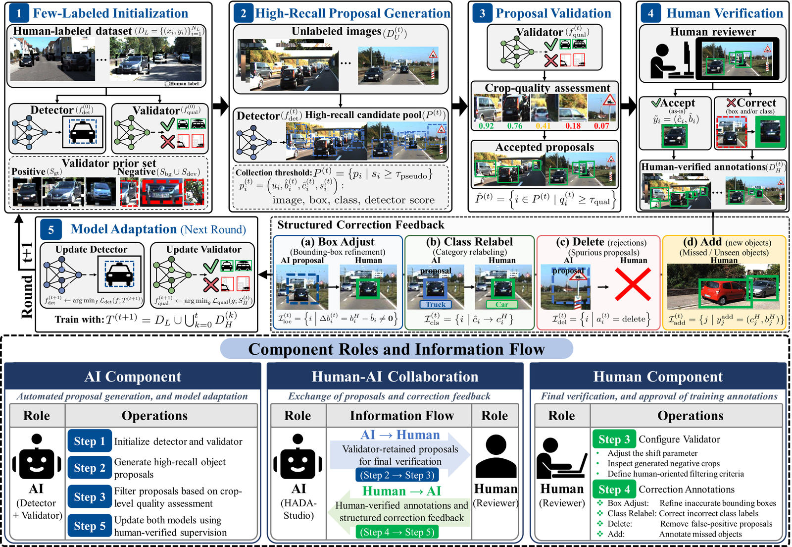
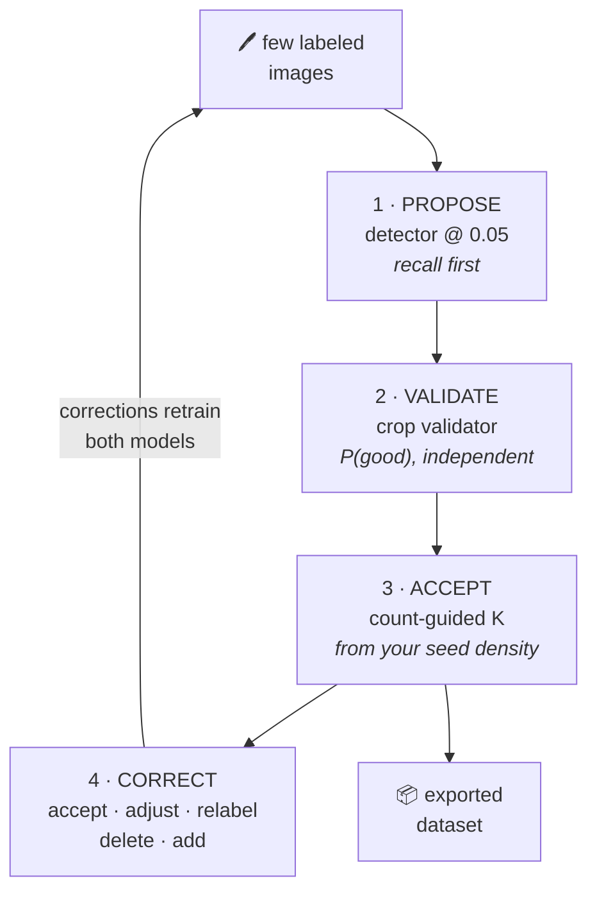
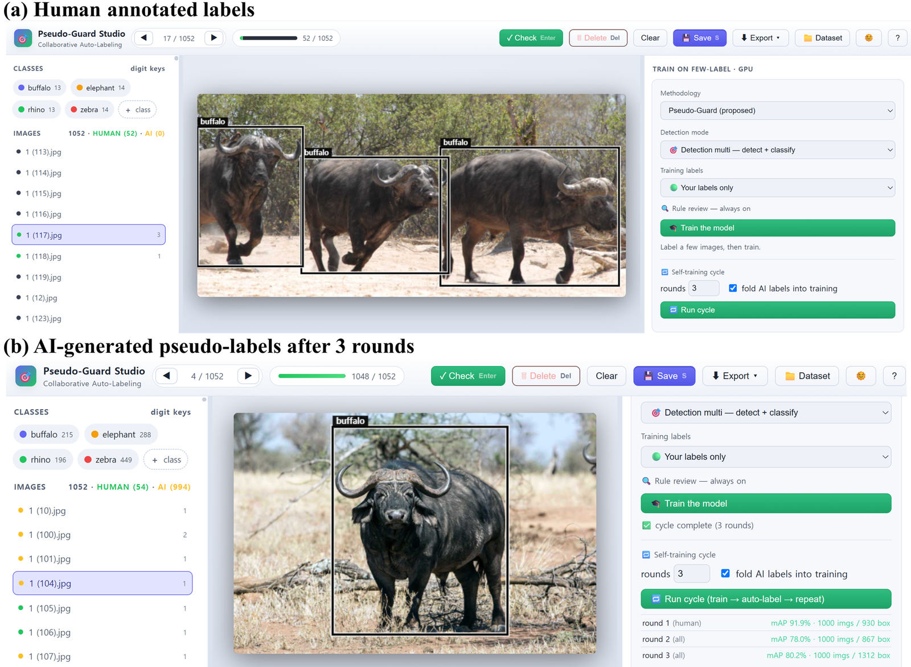
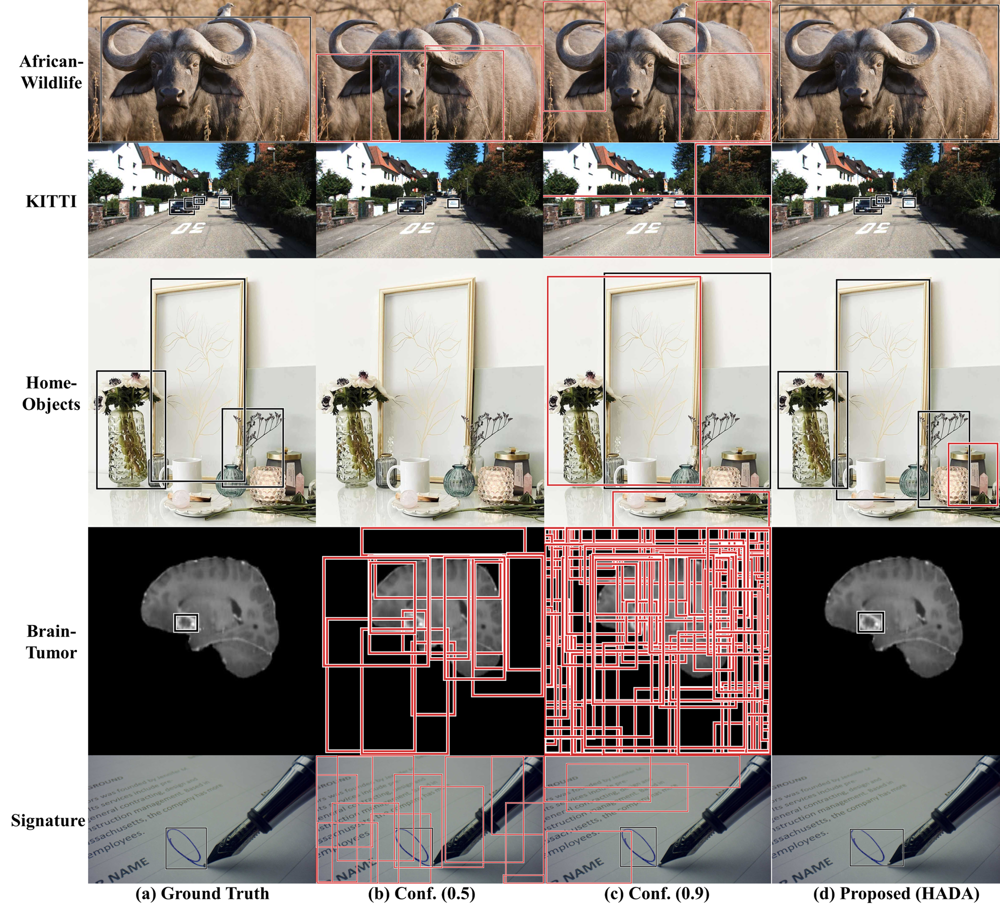
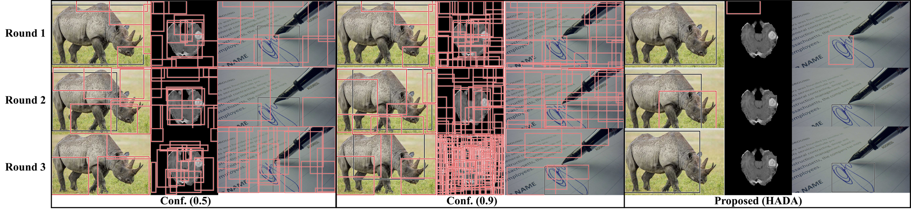
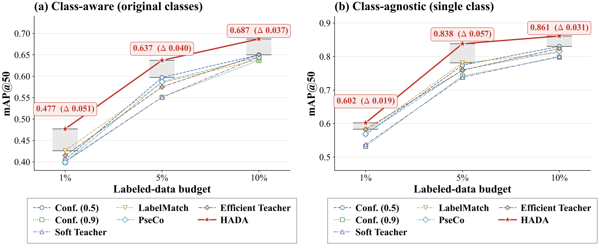
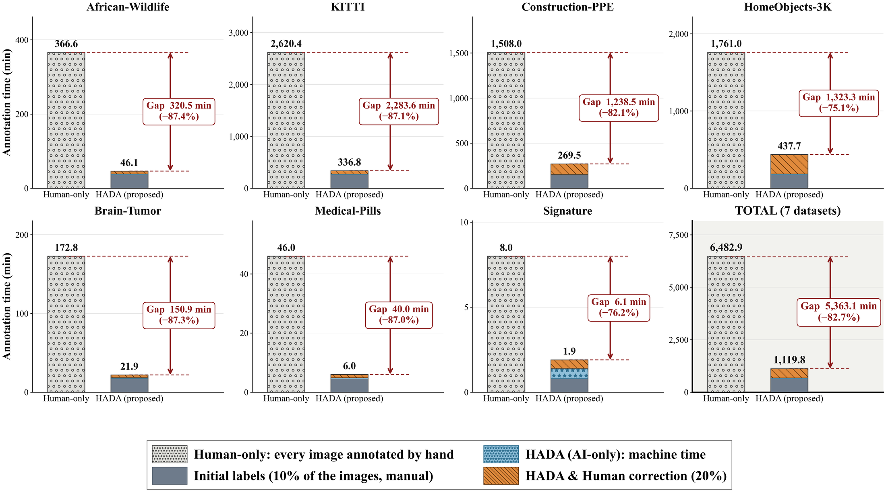
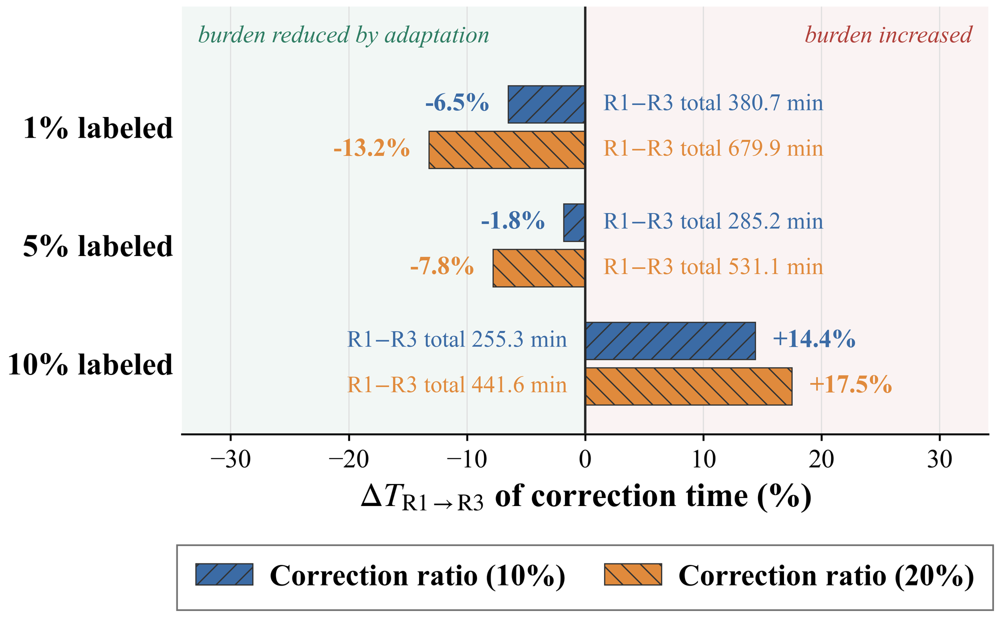

<h1 align="center">HADA-Studio</h1>

<p align="center">
  <b>Human–AI object-detection annotation with proposal validation and count-guided acceptance.</b>
</p>

<p align="center">
  
  
  
  
  
</p>

<p align="center">
  
</p>

**HADA-Studio** provides the interactive software environment for the **HADA** annotation workflow.
Label a handful of images, and it trains a detector **and** a separate proposal validator from
that handful, proposes annotations for everything else, and determines how many proposals to
accept per image from the object density observed in the labeled subset. You review and correct
the proposed annotations, and those corrections inform the next round.

> **The idea in one sentence:** the model that *generates* a box is not the model that *judges*
> it. A detector run at a permissive threshold is a high-recall proposal generator; an
> independent crop-level validator scores each proposal; acceptance is a policy over those
> scores, calibrated to the dataset's own object density rather than to a threshold guessed once.

Across seven public benchmarks, HADA reaches **0.860 mean matched IoU** against 0.49–0.69 for
confidence and SSOD baselines, and cuts annotation time from an estimated **6,483 minutes of
manual work to 934** — an **85.6% reduction** — while a human still reviews one image in ten.

---

## Contents

| | |
|---|---|
| [⚡ Quick start](#-quick-start) | install and run in four commands |
| [🔍 How it works](#-how-it-works) | the four-step loop and the negative-crop rule |
| [🖥️ The application](#️-the-application) | what the tool actually looks like |
| [📊 Results](#-results) | seven benchmarks, six baselines, annotation-time savings |
| [🗂️ Repository layout](#️-repository-layout) | where everything lives |
| [🛠️ Command-line tools](#️-command-line-tools) | training without the UI |
| [📦 Windows release](#-windows-release) | building the .exe and the portable release |
| [✅ Tests](#-tests) | what is verified, and how to run it |

---

## ⚡ Quick start

The annotator needs **Python 3.9+ and Pillow**. That is the entire dependency list — the server
is Python's own `http.server`.

```bash
git clone <this-repository> hada-studio
cd hada-studio
python -m pip install -r requirements.txt
python run_app.py
```

Open <http://127.0.0.1:8000>. With no arguments the app opens on a bundled 15-image sample
dataset, so you can see the whole loop before pointing it at your own data.

There is also a working folder you can point at directly — ten images of which **four are
already labeled**, so the count prior has a seed and Automate Label has something to do:

```bash
python run_app.py --images ./data/images --labels ./data/labels \
                  --classes buffalo,elephant,rhino,zebra
```

See [data/README.md](data/README.md) for the layout to copy when you bring your own images.

<details>
<summary><b>Enable training (optional — needs PyTorch)</b></summary>

Training runs in a **separate** environment. The app never imports torch, which is why the
annotator stays small and runs on machines with no GPU.

```bash
python -m venv .venv-train
. .venv-train/bin/activate                # Windows: .venv-train\Scripts\activate

# Pick the torch build for your machine FIRST:
pip install torch torchvision --index-url https://download.pytorch.org/whl/cpu      # no GPU
# pip install torch torchvision --index-url https://download.pytorch.org/whl/cu121   # CUDA 12.1

pip install -r requirements-train.txt
```

Then point the app at that interpreter:

```bash
python run_app.py --train-python .venv-train/bin/python
```

**No GPU?** Everything still runs. Every entry point defaults to `--device auto`: CUDA when it
is genuinely available, CPU otherwise — including when you explicitly ask for `cuda:0` on a
machine that does not have it. A full train-and-predict pass over the bundled 15-image demo
takes about 35 seconds on a CPU.

</details>

<details>
<summary><b>More ways to start</b></summary>

```bash
# a dataset folder — images, labels and class names are detected from it
python run_app.py --dataset ./data

# your own images (class names are read from the dataset if you omit --classes)
python run_app.py --images ./data/images --classes cell,rbc,wbc

# seed the first 5 images per class from ground truth (reproducible random draw)
python run_app.py --images ./data/images --classes cat,dog \
                  --seed-labels ./data/gt --seed-count 5

# serve a precomputed candidate overlay — full AI behaviour, no torch, no GPU
python run_app.py --images ./data/images --overlay ./artifacts/overlay.json

# where does this install keep its files?
python run_app.py --where
```

`python -m pglabel` is equivalent to `run_app.py`.

**Dataset layouts that are detected.** `--dataset` (and the start-screen preset cards) accept any
of these, so an export does not have to be reshaped first:

| layout | example |
|---|---|
| ultralytics split | `images/train` + `labels/train` |
| roboflow export | `train/images` + `train/labels` |
| flat | `images/` + `labels/` |
| images only | `images/` — the normal starting point for auto-labeling |

Class names are taken from `data.yaml` (inline list, `0: name` map, or `- name` list), else
`classes.txt` / `obj.names`, else sized from the class ids present in the label files. Images may
be `.jpg .jpeg .png .bmp .tif .tiff .webp` in any capitalisation.

</details>

---

## 🔍 How it works

<p align="center"></p>

One annotation round is four steps. The split between step 1 and step 2 is the whole point:



| Step | What happens | Where |
|---|---|---|
| **1 · Propose** | The detector runs at a deliberately permissive threshold (0.05, lowered further per image until something is found). Recall first — precision is somebody else's job. | `hada/models/detection` |
| **2 · Validate** | A DenseNet-121 scores each proposal *crop* for P(good), independently of the detector's own confidence. | `hada/models/classification` |
| **3 · Accept** | The box count in your labeled images sets a per-image K (or a global threshold), so acceptance matches how crowded this dataset actually is. | `pgcount/operating_point.py` |
| **4 · Correct** | Five structured actions — *Accept*, *Adjust*, *Relabel*, *Delete*, *Add*. Each is kept as a distinct signal and folded into the next round, so a correction adapts the models rather than only fixing one image. | `pglabel/` |

### The validator is trained on fabricated crops

The validator must exist before any detector output does, so it is trained on crops a **rule**
manufactures from your labels:

| Crop type | What it is | Label |
|:--|:--|:--:|
| `positive` | your ground-truth boxes, lightly jittered (±5%) | 🟢 good |
| `empty` | background boxes containing no annotated object | 🔴 noise |
| `deviated` | your boxes displaced **0.80× the box size** off their object | 🔴 noise |

The deviated crops are the interesting ones. Displace too far and every negative is trivially
empty background, so the validator never learns to reject a *nearly* right box — the exact error
mode that matters. Displace too little and the negatives overlap real objects.

**Mean matched IoU by shift magnitude** (macro-average over the seven benchmarks):

| Shift | 1% labeled | 5% labeled | 10% labeled |
|:--:|:--:|:--:|:--:|
| 0.4 | 0.658 | 0.796 | 0.786 |
| **0.80** ⬅ default | **0.843** | **0.856** | **0.881** |
| 1.2 | 0.761 | 0.760 | 0.837 |

You do not have to take that on trust: training **pauses** and shows you the crops the rule
produced, with a live preview of what the shift parameter does, before the validator learns
anything.

---

## 🖥️ The application

<table>
<tr><td width="100%">

**Few-label initialization, then iterative auto-labeling.** A small labeled subset initializes
both models; progressively updated models generate proposals over successive rounds.



</td></tr>
<tr><td>

**Reviewing the negative-crop rule.** Raising the deviated-shift parameter moves the fabricated
negatives from nearly object-aligned **(a)**, through partially overlapping **(b)**, to almost
pure background **(c)**. This is the pause in the middle of training, and it is where a human
sets the difficulty of what the validator learns to reject.


</td></tr>
<tr><td>

**Correcting proposals.** Each pair is an AI proposal (left) and the human-authorized annotation
after review (right): **(a)** *adjust* fixes geometry, **(b)** *relabel* fixes the class,
**(c)** *delete* removes a false positive, **(d)** *add* recovers a missed object. The four are
recorded as distinct feedback, not as one undifferentiated "edit".


</td></tr>
</table>

---

## 📊 Results

**Setup.** Seven public benchmarks, YOLOv8-n detector, DenseNet-121 validator, three annotation
rounds (R1–R3), label budgets of 1% / 5% / 10%. Every method sees the *same* candidate pool and the same
splits, so only the acceptance rule differs.

> **What this repository contains, and what it does not.** This is the *software* — the
> annotator, the algorithm library, the training entry points and the Windows packaging — and
> everything in it runs from this folder alone. It is not the experiment harness: the seven
> benchmark datasets (~83 GB) and the campaign scripts that produced the tables below are not
> included, so the numbers here are reported, not reproducible from this checkout. What you can
> reproduce is the *method* on your own data: `tools/train_and_predict.py` is exactly the
> pipeline those results were produced with.

| Dataset | Domain | Classes | Images | Objects/image |
|:--|:--|--:|--:|--:|
| African-Wildlife | Wildlife photography | 4 | 1,052 | 1.84 |
| Brain-Tumor | Brain MRI | 2 | 878 | 1.05 |
| KITTI | Autonomous driving | 8 | 5,985 | 5.42 |
| Construction-PPE | Construction safety | 11 | 1,132 | 8.04 |
| HomeObjects-3K | Indoor scenes | 12 | 2,285 | 8.24 |
| Signature | Document images | 1 | 143 | 1.00 |
| Medical-Pills | Pharmaceutical | 1 | 92 | 17.64 |
| **Total** | | | **11,567** | **64,984 objects** |

### 1 · What the noise actually looks like

Before any table: the two failure modes a fixed confidence cut produces, on the 1% budget where
the detector is weakest. **Black** boxes agree with the reference annotation, **red** boxes do not.

<p align="center"></p>

A restrictive threshold — Conf. (0.9) — keeps fewer proposals but never asks whether a
high-confidence crop is a *whole* object in the *right place*, so partial objects and background
boxes survive it. A permissive one — Conf. (0.5) — keeps far more, and with it the duplicates,
oversized and mislocalized boxes. Both are worst where the target is small relative to the frame:
Brain-Tumor and Signature. HADA changes the acceptance mechanism rather than the threshold — every
candidate is judged by the independent crop-level validator, then containment-based suppression
drops spatial duplicates. The leftover error on HomeObjects-3K is the honest part of the picture:
validation *reduces* annotation noise, it does not eliminate it.

<p align="center"></p>

The same three images, tracked across three model updates, show why the threshold is not the thing
to tune. Under confidence-only selection the errors do not wash out — in the Brain-Tumor example
overlapping boxes spread until they form a grid across the whole frame by R3, and the Signature
example ends up covered in boxes scattered over the document text. Once a wrong box is in the
pseudo-label set, the next round trains on it and predictions compatible with it come back. Because
detector confidence drives both proposal generation *and* acceptance, moving the threshold adds no
independent check on that loop.

HADA stays at no more than two boxes per image. It is not error-free in the early rounds — a
background box and a missed tumor in R1, a displaced signature box in R1, a partial rhino in R2 —
but none of them survives into the following round, and all three examples agree with the reference
by R3. The validator works class-agnostically, so what this demonstrates is filtering of
*objectness, localization and duplicate* errors; getting the category right remains the human's job.

### 2 · Against confidence and SSOD baselines

<p align="center"></p>

**Pseudo-label localization quality** — mean matched IoU, class-consistent one-to-one matching at
IoU ≥ 0.5, macro-averaged over the seven datasets:

| Label budget | Conf. (0.5) | Conf. (0.9) | Soft Teacher | LabelMatch | PseCo | Efficient Teacher | **HADA** |
|:--:|--:|--:|--:|--:|--:|--:|--:|
| 1% | 0.498 | 0.249 | 0.249 | 0.491 | 0.498 | 0.491 | **0.843** |
| 5% | 0.718 | 0.613 | 0.612 | 0.718 | 0.716 | 0.716 | **0.856** |
| 10% | 0.727 | 0.622 | 0.620 | 0.865 | 0.725 | 0.862 | **0.881** |
| **Overall** | 0.648 | 0.495 | 0.493 | 0.691 | 0.646 | 0.689 | **0.860** |

The gap is widest exactly where it matters: at a **1% budget the nearest baseline reaches 0.498
and HADA reaches 0.843**. Baselines score 0.000 on several datasets at that budget —
their thresholds accept nothing at all, which is what a fixed cut does when the detector is weak.

**Downstream detection utility** — mAP@50 of a fresh detector trained on each method's output and
evaluated on a held-out 20% test split:

| Label budget | Conf. (0.5) | Conf. (0.9) | Soft Teacher | LabelMatch | PseCo | Efficient Teacher | **HADA** |
|:--:|--:|--:|--:|--:|--:|--:|--:|
| 1% | 0.405 | 0.399 | 0.401 | 0.426 | 0.399 | 0.415 | **0.477** |
| 5% | 0.597 | 0.551 | 0.551 | 0.585 | 0.587 | 0.575 | **0.637** |
| 10% | 0.650 | 0.637 | 0.645 | 0.639 | 0.645 | 0.650 | **0.687** |
| **Overall** | 0.551 | 0.529 | 0.532 | 0.550 | 0.544 | 0.547 | **0.601** |

**The same, with the class labels removed** — mAP@50 under class-agnostic evaluation, which scores
a box on whether it found an object in the right place and ignores which category it was given:

| Label budget | Conf. (0.5) | Conf. (0.9) | Soft Teacher | LabelMatch | PseCo | Efficient Teacher | **HADA** |
|:--:|--:|--:|--:|--:|--:|--:|--:|
| 1% | 0.568 | 0.532 | 0.537 | 0.575 | 0.569 | 0.583 | **0.602** |
| 5% | 0.774 | 0.742 | 0.738 | 0.781 | 0.760 | 0.759 | **0.838** |
| 10% | 0.830 | 0.798 | 0.800 | 0.811 | 0.816 | 0.824 | **0.861** |
| **Overall** | 0.724 | 0.691 | 0.691 | 0.722 | 0.715 | 0.722 | **0.767** |

This one matters for interpreting the first table. HADA leads in 18 of the 21 dataset × budget
combinations here too, so the downstream gain comes from more reliable objectness and box placement
rather than from happening to assign better category labels. The substantive exception is
Construction-PPE at 1%, where nested and heavily overlapping objects are hard to validate and
suppress.

### 3 · Partial human correction pays for itself

Correcting a random 10% or 20% of each round's pseudo-labeled images, under the 10% label
budget. Values are the seven-dataset mean, with the relative change versus the AI-only pipeline:

| Correction effort | mIoU | mAP@50 | mAP@50:95 |
|:--|--:|--:|--:|
| AI only (nothing reviewed) | 0.881 | 0.687 | 0.474 |
| 10% of images | **0.889** *(+0.9%)* | **0.704** *(+2.5%)* | **0.497** *(+4.9%)* |
| 20% of images | **0.903** *(+2.5%)* | **0.730** *(+6.3%)* | **0.515** *(+8.7%)* |

At the 20% ratio every one of the 21 dataset × metric changes is positive. The gain concentrates
where the AI-only pipeline is weakest — Construction-PPE gains **+14.3%** mAP@50:95 from
correcting one image in ten, and HomeObjects-3K **+17.8%** mAP@50 at 20%.

### 4 · Annotation time

<p align="center"></p>

| Workflow | Total annotation time | vs. human-only |
|:--|--:|--:|
| Human-only (11,567 images, 64,984 objects) | 6,482.9 min | — |
| HADA, AI only | 678.2 min | **−89.5%** |
| HADA-Studio, 10% human review | 933.5 min | **−85.6%** |
| HADA-Studio, 20% human review | 1,119.8 min | **−82.7%** |

Total workflow time under the 10% label budget: human labeling and correction plus machine
processing. Almost all of the AI-only cost is the label budget itself — **648.5 min** of hand
labeling for the initial 10%, against **29.7 min** of machine time for all three rounds — so
review is what the remaining budget buys. Excluding machine time, active human time falls 90.0%
(AI only), 86.1% (10%) and 83.2% (20%).

Even the costliest collaborative setting saves 5,363 minutes — about **89 hours** of human
annotation — across the benchmark suite.

### 5 · The correction burden shrinks as the models adapt

<p align="center"></p>

Under scarce supervision, corrections make the next round cheaper: at a 1% budget the time spent
correcting falls **−6.5%** (10% correction) and **−13.2%** (20%) from round 1 to round 3. At a
10% budget the burden rises instead — **+14.4%** and **+17.5%** — because with a strong initial
detector there is less left for adaptation to recover, and more accepted boxes to review.

Cumulatively, a larger budget is still the cheaper one to correct: summed over the three rounds,
correction time drops **−32.9%** (10% correction) and **−35.0%** (20%) going from a 1% to a 10%
label budget, while the action count drops only −15.6% and −18.7% — the corrections that remain
are the cheap ones, not the expensive missed-object additions.

---

## 🗂️ Repository layout

```
pglabel/          the annotation application — no torch, no web framework
  paths.py          every filesystem root, in a checkout or a packaged install
  labelio.py        YOLO label files (pure functions)
  geometry.py       overlap, NMS, containment-aware de-duplication (pure functions)
  state.py          the session: open dataset, ownership, job and review-gate state
  methods.py        acceptance methodologies + decisions derived from the human seed
  candidates.py     the prediction cache and the two Automate-Label paths
  noise_rule.py     the negative-crop rule as the review screen exposes it
  training.py       running the trainer subprocess, and the review that interrupts it
  dataset_setup.py  folder picker, dataset presets, opening a dataset, seeding
  api.py cli.py desktop.py export.py backend.py
  static/           the single-page UI (index.html + css/ + js/)

pgcount/          count-guided acceptance: seed density → operating point → selection
hada/      the HADA algorithm library: detector + validator wrappers, the crop rule
tools/            training entry points, run by the SEPARATE torch interpreter
packaging/        Windows executable, installer, portable release, build audit
tests/            224 tests — standard library + Pillow, no test dependencies
data/             a runnable working dataset — 10 images, 4 labeled  [data/README.md]
demo/             the sample dataset baked into the installer (read-only once packaged)
docs/figures/     the figures used above
```

The layering is deliberate: the `hada` package implements HADA proposal generation and scoring, while `pgcount` decides
which are accepted, `pglabel` is the human's side of it. Acceptance policy can be changed,
compared or ablated **without touching a model** — which is what makes "same AI, different
collaboration" measurable rather than rhetorical.

---

## 🛠️ Command-line tools

Run these with the **training** interpreter (the one that has torch). Every tool takes
`--device auto|cpu|cuda:0` and defaults to `auto`.

```bash
# the Train button, from a terminal: detector + validator + candidate overlay
python tools/train_and_predict.py --images ./data/images --labels ./data/labels \
    --classes cat,dog --work-dir ./work \
    --out-overlay ./artifacts/overlay.json --out-report ./artifacts/report.json

# just the validator (cheap: no detector run)
python tools/train_validator.py --images ./data/images --labels ./data/labels \
    --out ./artifacts/validator

# fabricate the review crops for a given rule
python tools/gen_noise_crops.py --images ./data/images --labels ./data/labels \
    --work-dir ./work --out-dir ./work/crops --manifest ./work/crops.json

# freeze a candidate overlay so the app needs no GPU at all
python tools/precompute_overlays.py --images ./data/images \
    --detector ./work/detection_model.pt --validator ./work/classification_model.pt \
    --out ./artifacts/overlay.json

# no models at hand? a synthetic overlay exercises the whole selection path
python tools/precompute_overlays.py --synthetic --out ./artifacts/overlay.json
```

Drop base weights (`yolov8n.pt`, …) into [`weights/`](weights/) to train offline; otherwise
ultralytics downloads them on first use.

---

## 📦 Windows release

Two routes — the second does not need a Windows machine.

| | `packaging/build.py` | `packaging/make_portable_zip.py` |
|:--|:--|:--|
| Build machine | **Windows only** | any OS, including Linux |
| What ships | one frozen `PG-Label.exe` + `_internal/` | Python runtime + readable sources |
| Size | ~60–90 MB | ~19 MB |
| Installer | Inno Setup `PG-Label-Setup-<version>.exe` | `Install PG-Label.exe` (per user) |

```bash
# A. a real .exe (run this ON Windows)
packaging\build.bat                       # or: py -3 packaging\build.py
py -3 packaging\build.py --installer      # also compile the Inno Setup installer

# B. a portable release, buildable anywhere
python packaging/make_portable_zip.py     # -> hada-studio.zip
```

Route B downloads Python's official Windows embeddable runtime and a matching Pillow wheel the
first time it runs (cached under `packaging/build/cache`), so it needs network access once.

Neither bundles PyTorch: freezing it would add ~2.5 GB and still not give the user a working
CUDA stack, because the right wheel depends on their driver. Training runs in a separate
interpreter, installed once with `packaging/install_training_pack.bat`.

Before either route, audit the tree — the same check `build.py` runs, and the one that catches
"works from source, broken once packaged":

```bash
python packaging/verify_build.py                                  # source tree, any OS
python packaging/verify_build.py --dist packaging/dist/PG-Label   # a built folder
```

See [docs/WINDOWS.md](docs/WINDOWS.md) for the full checklist.

---

## ✅ Tests

No test dependencies — the suite runs on the standard library plus Pillow, the same footprint as
the app:

```bash
python -m unittest discover -s tests -t tests -v
```

| Module | What it covers |
|:--|:--|
| `test_api.py` | a real HTTP server on a temp dataset: routes, ownership, export, guards |
| `test_training.py` | the trainer subprocess, the review gate, Stop, the child environment |
| `test_contract.py` | UI ↔ route agreement, and the packaged (frozen) path layout |
| `test_geometry.py` | overlap, NMS, containment-aware de-duplication |
| `test_methods.py` | the acceptance registry and the seed-derived decisions |
| `test_noise_rule.py` | rule validation and the deviated-box preview geometry |
| `test_hada.py` | config validation, CPU fallback, negative-crop geometry |
| `test_pgcount.py` | seed density, operating points, crops, candidate sources |
| `test_windows.py` | path traversal, console code pages, read-only deletes, .cmd/.vbs encoding |
| `test_labelio.py` | the YOLO label format, clipping, BOM, line endings |
| `test_tools.py` / `test_packaging.py` | tool CLIs, the release manifest, the build audit |
| `test_sample_data.py` | the `data/` folder's shape, and the crop pipeline's memory ceiling |
| `test_readme.py` | this file's own links, figures and numbers |

Tests that need torch skip themselves when it is not installed.

---

## Citation

This repository is the software implementation, **HADA Studio**, of the **HADA** framework:

> *HADA: A Human–AI Collaborative Framework for Object-Detection Data Engineering to Enhance Data
> Quality and Reduce Human Effort.* Under review.

Until the paper is published, cite this repository.

## License

MIT — see [LICENSE](LICENSE).
